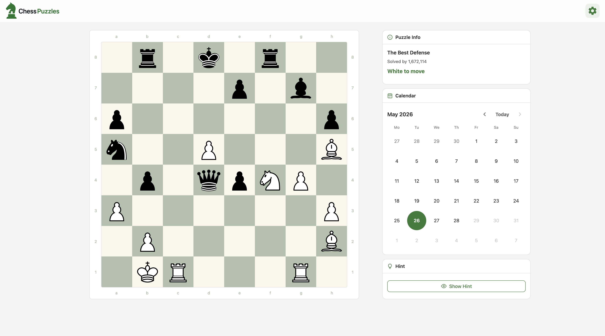
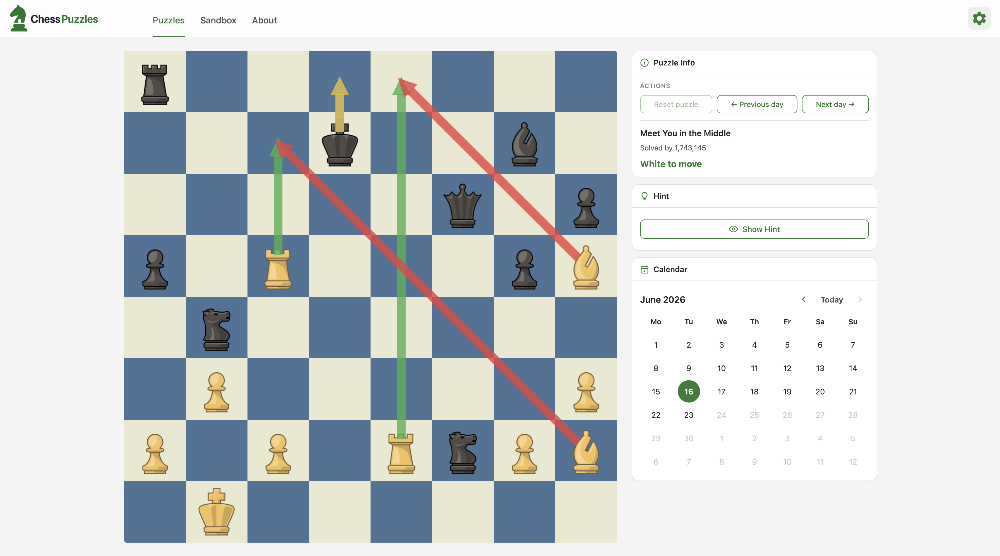
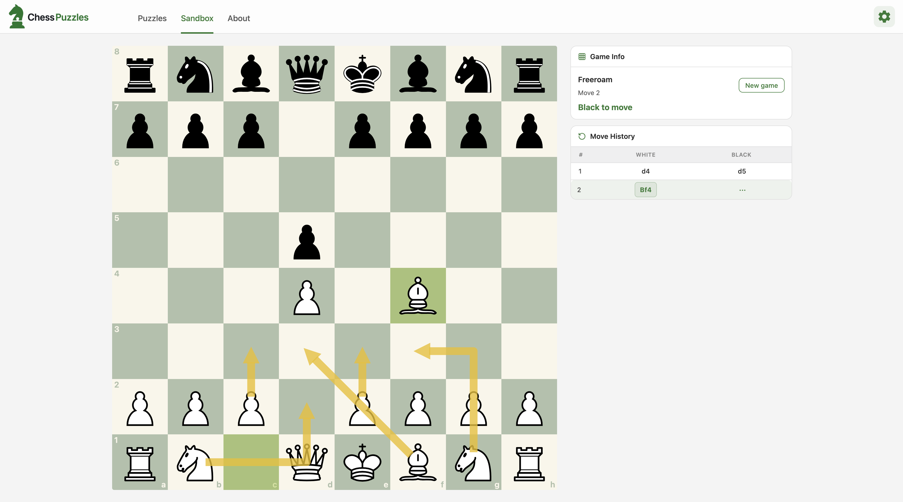
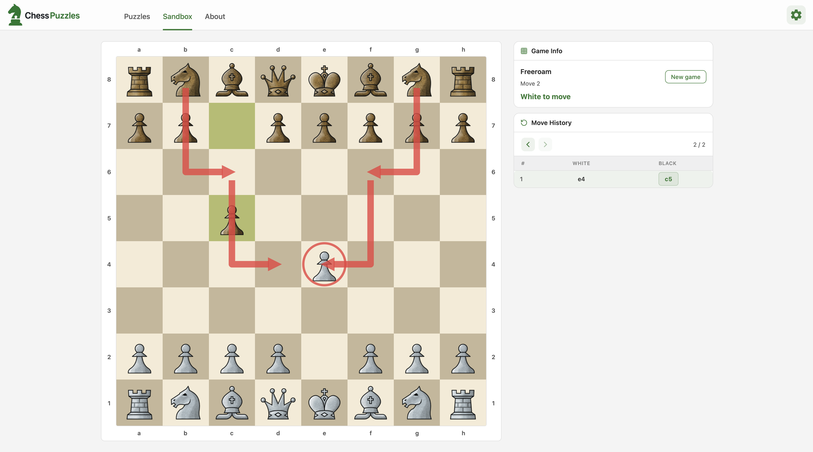

# Chess Puzzles

Browse Chess.com daily puzzles by date. Pick a day on the calendar, load the puzzle for that date, and solve it on a themed board.

## Screenshots

<table>
  <tr>
    <td align="center" width="50%">
      
    </td>
    <td align="center" width="50%">
      
    </td>
  </tr>
  <tr>
    <td align="center" width="50%">
      
      <br />
      <em>London System</em>
    </td>
    <td align="center" width="50%">
      
      <br />
      <em>Sicilian Defense</em>
    </td>
  </tr>
</table>

## Setup

### Prerequisites

- Node.js 18+
- npm

### Install and run

```sh
git clone https://github.com/haykgabrielian/chess-puzzles.git
cd chess-puzzles
npm install
npm run dev
```

Open `http://localhost:5173`. The app redirects to today's date, for example `/2026-05-27`.

The frontend loads puzzles from the backend API. Start the backend first:

```sh
cd ../chess-puzzles-backend
npm install
cp .env.example .env
npm run sync
npm run dev
```

Then run the frontend (`npm run dev` in this repo). Vite proxies `/api` to `http://localhost:3001`.

### Puzzle data

Puzzle sync now runs in **`chess-puzzles-backend`**. It fetches from Chess.com, saves JSON under `chess-puzzles-backend/puzzle/`, and upserts into MongoDB.

| Command (in backend repo) | Description |
|---------------------------|-------------|
| `npm run sync` | Fetch missing/outdated months and save to DB |
| `npm run sync:check` | Dry run — show what would be fetched |
| `npm run sync:force` | Re-fetch all months |
| `npm run migrate` | Import existing local JSON files into DB |

## Scripts

| Command | Description |
|---------|-------------|
| `npm run dev` | Start Vite dev server |
| `npm run build` | Production build |
| `npm run preview` | Preview production build |
| `npm run typecheck` | TypeScript check |
| `npm run lint:check` | ESLint |
| `npm run lint` | ESLint with auto-fix |

## Tech stack

- React 19 + TypeScript
- Vite
- TanStack Router — date-based URLs (`/YYYY-MM-DD`)
- TanStack Query — puzzle fetching from backend API
- styled-components — UI and themes

## Project structure

```
src/
├── api/           # Puzzle fetch helpers
├── assets/        # Logos and piece SVGs
├── components/    # Board, sidebar, header
├── context/       # Puzzle, theme, board theme providers
├── helpers/       # FEN, dates, board themes
├── hooks/         # usePuzzleForDate
├── pages/         # Home
└── router.tsx     # /$date routes

screenshot/        # App screenshots (page.png, page1.png, page2.png, page3.png)
```

Backend repo: `chess-puzzles-backend/` — API, MongoDB, Chess.com sync job.

## License

MIT
